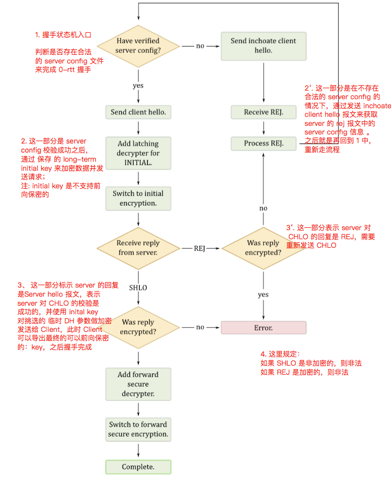

# 背景介绍

+ QUIC Crypto 是 Google 在开发 QUIC 协议时，为了实现 0-RTT 的传输加密握手而设计的一种类似于 TLS的协议，这个协议基于 DH 算法实现，背景是再当时 TLS1.3 还未出现作为一种替代算法那。在 QUIC 的设计文档和当前最新的代码中，可以发现 QUIC Crypto 是和 TLS1.3 等价的一种协议。关于这个协议的详细细节可以参考附件中的文档

+ 在当前的 Chromium 代码中，QUIC 提供的 demo 是一种阉割版的实现，未实现 QUIC Crypto 的 0-rtt 功能，在这个文档中，我们通过探索 QUIC Crypto 的算法实现了 QUIC Demo 的 0-rtt 功能。

# QUIC Crypto 算法介绍

在这个部分中主要介绍 QUIC Crypto 实现握手的交互流程，从而实现 0-RTT 的功能，关于秘钥计算与推导的内容这里不做介绍
+ 总体来说，QUIC Crypto 可实现：
    + 在 Client 端发起建链时，如果存储了之前握手的相关信息，这里称为 server config ，则可以通过 server config 中保存的秘钥发起0-RTT握手，并发送加密数据；
    + 如果 Client 没有相关信息，则需要多一个 RTT 来与 server 协商秘钥

+ 另外，在 QUIC Crypto 整个算法过程中，存在两个加密状态，分别是：
    + 在 0-RTT 或者 1-RTT 收到 REJ 报文后，client 使用的是根据 server 的 long-term DH 参数，推导出的不具有前项加密的 initial key 来进行加密（这个 initial key 的有效期可能会存在 several days）
    + 在 收到 SHLO 报文之后，SHLO 中带有 server 的 临时 DH 参数，Client 可推导出最终的具有前项加密功能的最终秘钥 

+ 在整个过程中，server 依赖 “Source Address Token” 对 client 发起的连接做地址校验。

# 防止 Source Address 欺骗

在 TCP 中，通过建链前的三次握手，server 会对发起的 tcp 建联请求发起地址校验，而在 QUIC 的加密握手中，通过使用
“Source Address Token”  机制来防止攻击(这个 token 是实现 0-rtt 的关键)。运行机制如下：

+ 从 server 端来说：source address token 由 server 生成，“关联一个 client ip” 和 “过期的时间”，并被加密和认证，对于 client 的请求，server 会把这个 token 带给 拥有这个 ip 的client。并希望在后序的握手报文中，携带这个 token
+ 对于client端来说：这个 token 是透明的，拥有这个 token ，表明 client 拥有这个地址。在后序发起请求时，client 通过带上这个 token 来表明自己拥有真实的 ip。在后序的握手过程中，如果 client 的地址没有发生变换，那么可以直接使用这个 token 发起 0-rtt 连接
+ 但是，由于这个 token 是不记名的，所以如果 token 被窃取的话，还是会导致地址欺骗的，对于类似情况，server 可以通过缩短 token 的有效时间来进行预防。带来的坏处就是 0-rtt 的完成率是下降的。

# 防止重放攻击

TLS 协议中，client 和 server 都会给对方携带一个临时有效的 random number，用来产生新的秘钥。而在 Crypto 的 0-RTT中，
由于没有这个 round trip，所以是无法让 server 产生这个秘钥的。即 0-RTT 阶段 Client 和 Server 握手使用的是 cache 在本地的，
非临时的秘钥，这个秘钥无法做到前向安全，为了避免重放攻击，这个秘钥的有效时间会被严格限制，比如一般有限期为5-7天。但是0-RTT 之后，
会协商出由临时 DH 参数导出的具有前向安全的秘钥来防止重放攻击。

# 状态机分析

## Client 端状态机
+ 如下图所示，在 Client 发送握手报文之前，会先判断是都cache了 server config 相关的文件，server config 相关文件中存储了之前握手的一些信息，例如证书等，这个文件即我们实现 0-RTT 功能的关键；
+ 如果 server config 存在并验证有效，则发起完整的 CHLO 报文，这里对 serve config 做校验的文件，也是我们实现 0-RTT 功能的关键；
+ 如果 server config 不存在，或者验证无效，则发起 Inchoate CHLO，用来获取 Server 的REJ报文，报文中包扩：server config(SCFG)、 source address token(STK)、证书链等重要信息；
+ CHLO 报文中，需要携带 server config 中包含的一些信息，例如 Server Config ID(SCID)、以及 STK 等，由 server 做校验
+ 如果 Server 校验成功，则会发 Server Hello 报文，否则会发 REJ 报文，Client 需要重试



## Server 端状态机
+ server 端如果收到的是 Incholate Client Hello 报文(判断依据是报文中是否携带 Server Config ID(SCI) 以及 STK 等信息)，则会发送 REJ 报文，报文中会携带 server config
+ server 端如果收到的是 CHLO 报文，则会对 CHLO 中携带的信息进行校验，所以在 server 生成这个信息的时候也需要做磁盘持久化，这部分也是 server 改造的一个关键点
+ 如果 对 CHLO 报文校验成功，则会发送 SHLO，携带临时的 DH 参数

上述状态机的代码参见：
```
chromium/src/net/third_party/quic/core/quic_crypto_client_handshaker.cc
chromium/src/net/third_party/quic/core/quic_crypto_server_handshaker.cc
```

# 工程实践
通过上述分析，为了实现 0-RTT，需要 client 和 server 均存储 0-RTT 中需要的 server config 以及其他的一些信息，完整的信息包括：

## Client 需要持久化的数据

1. server_config_(SCFG)
握手时生成的一些信息，包括：SCID(Server Config ID)、KEXS(Key exchange algorithms)、AEAD(Authenticated encryption algorithms )、PUBS(A list of public values) 等
client 可根据 server_config_ 生成 initial key 
2. source_address_token_(STK)
server 生成的用于对 client 做校验的一个 opaque token，client 在 CHLO 报文 echo 即可
3. cert_sct_
根证书的签名时间
4. certificates
证书序列
5. chlo_hash_
上个 CHLO 报文的 Hash 值
6. server_config_sig_
对 server config 的签名

其中 3、4、5、6主要用于生成对单签 server config 的校验

## Server 需要持久化的数据

1. server_config_(SCFG)
同 Client 中的 SCFG，server 会根据 SCID 来判断 Client 发送的 SCFG 是否合法
2. source_address_token_(STK)
同 Client 中的 STK，server 会根据 STK 对 Client 的真实性做判断
3. priority_
在 server config 存在多个情况下，做个用于标识当前 config 的优先级
4. primary_time_
在 server config 存在多个情况下，当前 config 成为 primary config 的时间


## Client 加载和持久化文件的时机
+ Client 在启动时，会从磁盘中加载文件，并对文件做 parse 获取相关信息，并初始化 crypto 相关信息
+ 如果文件不存在，则在握手完成后，进行持久化

## Server 加载和持久化文件的时机
+ serve 在启动生成 dispatcher 的时候会加载文件，如果文件不存在，则会生成一个新的并同时做持久化

# 附录